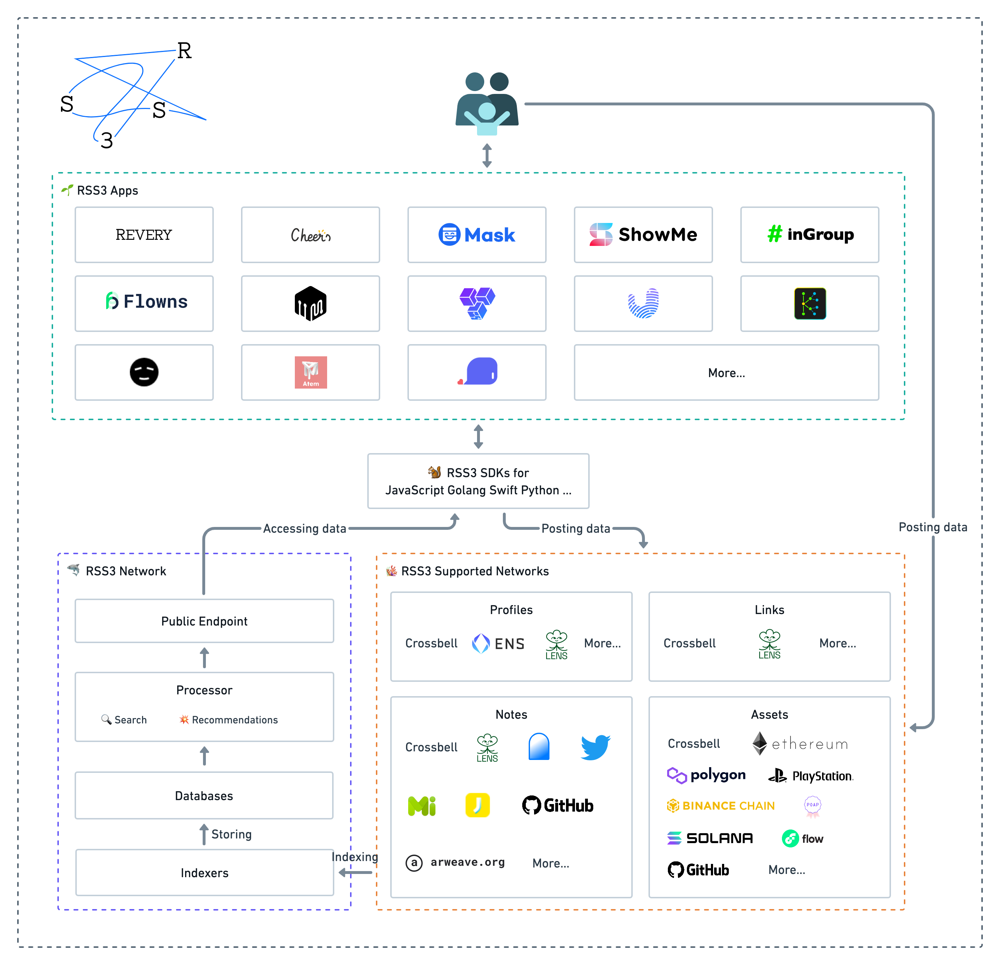

# 介绍

    

> RSS3 是开放信息聚合协议，旨在为 Web3 提供高效且去中心化的信息分发方式。

## 什么是 RSS3？

创造、传播和分发信息的权利属于人们，它不应被中心化平台所掌控。这是网络时代人们生活所需最基本的权利。

在过去的 20 年里，内容及其传播渠道逐渐被几个数据超级大国所控制，这形成了一种有害的中心化氛围，为了利润而牺牲了隐私和自由，这种氛围进一步阻碍了创新：无论你的设计和程序写得有多好，你的应用程序都无法与数据垄断者公平竞争。

世界始终渴望一种崭新的信息聚合方式。RSS 曾是那个时代的先锋，现在是时候由我们接过接力棒并继续前进探索了。

RSS3 是吸取了 RSS 精华的崭新开放信息聚合协议，旨在为 Web3 提供高效且去中心化的信息分发方式。

- [Here comes RSS3](https://rss3.notion.site/1-Here-comes-RSS3-501aa9df6dba40caae0a53eb2de6f060)
- [What is the relationship between RSS3 and RSS?](./faq.md#q-what-is-the-relationship-between-rss3-and-rss)
- [Is RSS3 a SocialFi?](./faq.md#q-is-rss3-a-socialfi)

## RSS3 如何运作？

在 RSS3 系统下，用户通过公钥加密技术拥有并控制自己的文件，而应用程序只能使用并不能控制用户的文件。你可以通过[阅读《Platformless Media》](https://rss3.notion.site/3-Platformless-Media-55505c45a49743a2b89304abcb4a90da)了解更加详细的信息。

RSS3 协议定义了信息存储和交换的格式，通过该协议，用户在分布式的 RSS3 网络中存储签名信息，包括个人资料(profile)、链接(link)、笔记(note)和资产(asset)，其中笔记和资产不仅包括用户自己发表的签名内容，还包括从其他网络自动索引的内容。你可以阅读[关于 RSS3 协议的说明](/protocol.html)了解细节内容。

RSS3 协议设计的非常灵活，用 RSS3 协议和 RSS3 网络，你可以做很多类型的应用，两个典型的代表是用户画像应用和信息流应用，我们分别由对应的两个演示应用 [Cheers](https://cheers.bio/) 和 [Revery]。但我们无法限制也无法预测您将构建什么样的应用程序。

在对协议有所了解的情况下，使用 [RSS3 SDK](/sdk.html) 或直接调用 [API](/api.html) 是开发应用最快的方式。

[阅读我们的白皮书](/RSS3-Whitepaper.pdf)也是个增进对协议即将到来的分布式 RSS3 网络了解的好方法。

如果有任何问题，你可以在 [GitHub](https://github.com/NaturalSelectionLabs/RSS3)、[Discord](https://discord.gg/rss3)、[Telegram](https://t.me/rss3_en) 或 [Twitter](https://twitter.com/rss3_) 找到我们。我们很乐意提供帮助！

RSS3 及其附属网络都是开发且无需许可的——欢迎[提交你所开发的 RSS3 应用](https://github.com/NaturalSelectionLabs/RSS3/issues/21)。如果有需要，我们也可以提供技术或操作帮助。

扩展阅读：

- [What is the relationship between RSS3 and RSS3 Network?](./faq.md#q-what-is-the-relationship-between-rss3-and-rss3-network)
- [Does RSS3 support recommendation algorithms?](./faq.md#q-does-rss3-support-recommendation-algorithms)

## 社区

我们有着活跃且不断壮大的社区。欢迎任何人加入我们，帮助它的发展，或者只是保持关注。

随时欢迎加入我们的 [Discord 服务器](https://discord.gg/rss3)。

同时我们也使用 [GitHub](https://github.com/NaturalSelectionLabs) Issues 和 Discussions。

也可以[关注我们的 Twitter](https://twitter.com/rss3_) 获取最新动态。

  

## 生态

### RSS3 应用

欢迎[提交你所开发的应用](https://github.com/NaturalSelectionLabs/RSS3/issues/21)！

    
    
    
    
    
    
    
    
    
    
    
    
    
    <a target="_blank" href="https://github.com/NaturalSelectionLabs/RSS3/issues/21">Your logo</a>

### 支持网络

**区块链**

    
    
    
    
    
    
    

**应用**

    
    
    
    
    
    

**域名服务**

    
    
    

