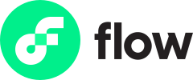

# 介绍

    

> RSS3 是开放信息聚合协议，旨在为 Web3 提供高效且去中心化的信息分发方式。

## 为什么是 RSS3？

创造、传播和分发信息的权利属于人们，它不应被中心化平台所掌控。这是网络时代人们生活所需最基本的权利。

在过去的 20 年里，内容及其传播渠道逐渐被几个数据寡头所控制，这形成了一种有害的中心化氛围，为了利润而牺牲了隐私和自由，这种氛围进一步阻碍了创新：无论你的设计和程序写得有多好，你的应用程序都无法与数据垄断者公平竞争。

世界始终渴望一种崭新的信息聚合方式。RSS 曾是那个时代的先锋，现在是时候由我们接过接力棒并继续前进探索了。

RSS3 是吸取了 RSS 精华的崭新开放信息聚合协议，旨在为 Web3 提供高效且去中心化的信息分发方式。它规定了信息存储和交流的格式，通过这种设计优雅、用户友好的内容格式，客户端可以轻松地以统一的格式访问各种内容源，而不需要大量的兼容逻辑。

扩展阅读：

- [Here comes RSS3](https://rss3.notion.site/1-Here-comes-RSS3-501aa9df6dba40caae0a53eb2de6f060)
- [What is the relationship between RSS3 and RSS?](./faq.md#q-what-is-the-relationship-between-rss3-and-rss)
- [Is RSS3 a SocialFi?](./faq.md#q-is-rss3-a-socialfi)

## RSS3 如何运作？

[RSS3 协议](./protocol/README.md)将信息分为四类——资料、链接、资产、帖子

[RSS3 应用](#RSS3 应用) 使用 RSS3 SDK 以 RSS3 协议所规定的格式访问和发布数据。

使用 [RSS3 SDK](./sdk/list.md) 从 RSS3 网络中获取数据，并将数据发布到 RSS3 支持的网络上。

[RSS3 网络](./network/roadmap.md)从各种 RSS3 支持网络中爬取数据，将数据缓存到自己的高效数据库中，并做预处理，如应用智能推荐算法和提供搜索功能。

RSS3 及其附属网络都是开放且无需任何授权许可的——欢迎[提交你所开发的 RSS3 应用](https://github.com/NaturalSelectionLabs/RSS3/issues/21)。

扩展阅读：

- [Platformless Media](https://rss3.notion.site/3-Platformless-Media-55505c45a49743a2b89304abcb4a90da)

## 社区

欢迎任何人关注以及加入我们，共同见证与促进它的发展。

随时欢迎加入我们的 [Discord 服务器](https://discord.gg/rss3)。

同时我们也使用 [GitHub](https://github.com/NaturalSelectionLabs) Issues 和 Discussions。

也可以[关注我们的 Twitter](https://twitter.com/rss3_) 获取最新动态。

  

## 生态

### RSS3 应用

欢迎[提交你所开发的应用](https://github.com/NaturalSelectionLabs/RSS3/issues/21)！

    
        
            
        
        
            <h4>Revery</h4>
            
A Web3 native social media with great interoperability

        
        
            <a target="_blank" href="https://revery.so/">Open Revery</a>
        
    
    
        
            
        
        
            <h4>Cheers</h4>
            
Another cross-platform Web3 Profile

        
        
            <a target="_blank" href="https://cheers.bio/">Open Cheers</a>
        
    
    
        
            
        
        
            <h4>Mask</h4>
            
RSS3 work with Mask Network to bring the best Web3 enhanced Web2 social experience

        
        
            <a target="_blank" href="https://mask.io/">Open Mask</a>
        
    
    
        
            
        
        
            <h4>ShowMe</h4>
            
RSS3 powers the profile page of ShowMe, an NFT social subscription platform

        
        
            <a target="_blank" href="https://showme.fan/">Open ShowMe</a>
        
    
    
        
            
        
        
            <h4>inGroup</h4>
            
RSS3 powers the activity feed of different groups in crypto organizations of InGroup, a web3 social network

        
        
            <a target="_blank" href="https://ingroup.chat/">Open inGroup</a>
        
    
    
        
            
        
        
            <h4>Flowns</h4>
            
RSS3 powers the profile of FlowNS, an opening protocol of identities and assets

        
        
            <a target="_blank" href="https://www.flowns.org/">Open Flowns</a>
        
    
    
        
            
        
        
            <h4>Une Meta</h4>
            
RSS3 support his social-enforced NFT trading platform to bring out a refreshing NFT experience

        
        
            <a target="_blank" href="https://www.info.unemeta.com/">Open Une Meta</a>
        
    
    
        
            
        
        
            <h4>Matrix World</h4>
            
RSS3 powers the social profile of characters in this metaverse

        
        
            <a target="_blank" href="https://matrixworld.org/home">Open Matrix World</a>
        
    
    
        
            
        
        
            <h4>UniPass</h4>
            
RSS3 constructs part of Unipass’s user social graph

        
        
            <a target="_blank" href="https://www.unipass.id/">Open UniPass</a>
        
    
    
        
            
        
        
            <h4>KNN3</h4>
            
A web3 users topological graph network where a major part of data comes from RSS3

        
        
            <a target="_blank" href="https://www.knn3.xyz/">Open KNN3</a>
        
    
    
        
            
        
        
            <h4>Interface Search</h4>
            
A social search engine where a major part of data comes from RSS3

        
        
            <a target="_blank" href="https://search.interface.social/">Open Interface Search</a>
        
    
    
        
            
        
        
            <h4>Atem</h4>
            
RSS3 provides data for profile and also community activities for this decentralized community

        
        
            <a target="_blank" href="https://www.atemnet.com/">Open Atem</a>
        
    

### RSS3 支持网络

#### 资料

    Crossbell
    
    

#### 链接

    Crossbell
    

#### 帖子

    Crossbell
    
    
    
    
    
    
    

## 资产

    Crossbell
    
    
    
    
    
    
    
    
    
    
    

